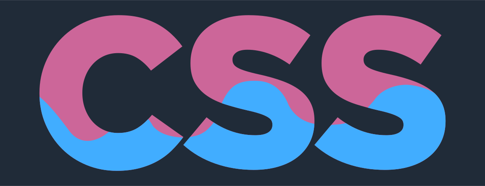

<h1 align="center">Water.css</h1>
<p align="center">🌊 A drop-in collection of CSS styles to make simple websites just a little nicer</p>

[](https://watercss.kognise.dev/)

<br>

Forked and updated to support `theme-dark` and `theme-light` class selectors to allow manual style switch without swapping to another `CSS` file.

## Build:
1. Install dependencies:
    ```
    npm i
    ```
2. To build a minified version, run:
    ```
    npm run build
    ```

Or use prebuilt `dist/water.min.css` file.